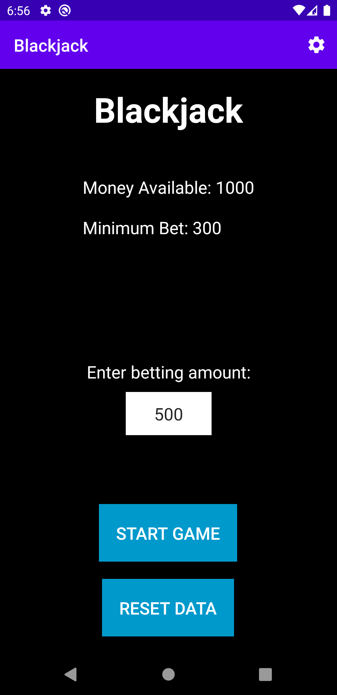
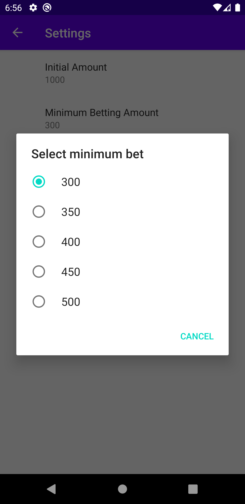
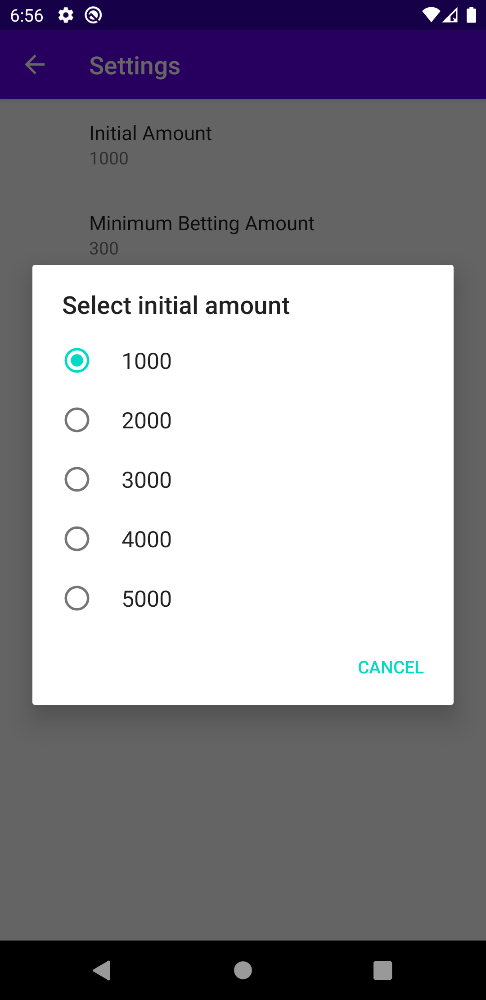
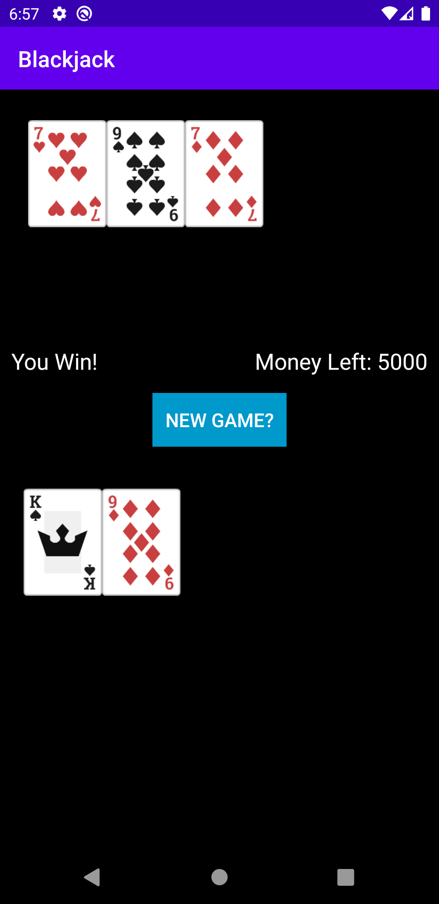
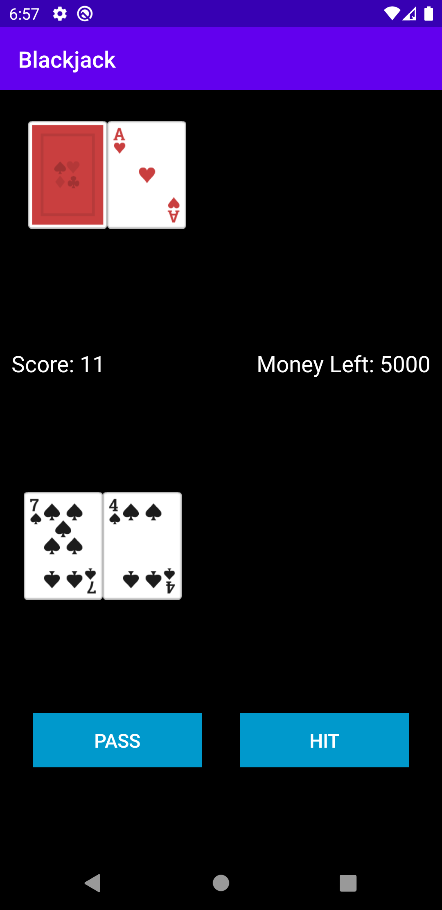
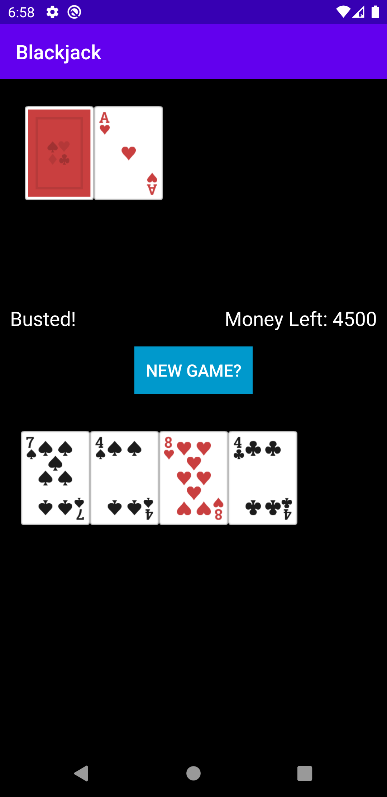

# Blackjack
A simple Blackjack game in Android built using Kotlin standard classes and frameworks.

## Features

* Single-player game - Currently only dealer and a single person can play the game.
* Basic Blackjack rules - Follows the common blackjack rules as described here : https://en.wikipedia.org/wiki/Blackjack#Rules
* The player starts with an initial amount and can place a bet before starting the game. 
* If the player wins the bet, amount gets added to his available money else it gets deducted according to standard casino rules: https://en.wikipedia.org/wiki/Blackjack#Rules_of_play_at_casinos
* The user can play multiple rounds with persistent cash pool. If he doesn't have enough money he is kicked out of the game so that he can change the betting amount or reset the data.
* Some of the game settings (initial amount and minimum bet) are customizable by going to the settings screen as shown in below screenshots.
* If the user doesn't have enough money left, he can reset the data to get back the default values for money and minimum bet.

## Screenshots

  
  
  
  
  
  

## Code Architecture

The codebase of the app is divided into the following 3 packages:
1. **util** - This package has classes containing the helper function required for building the logic of the game.
2. **ui** - It contains the activity files for the different screens of the app. **MainActivity.kt** is the starting screen of the app where the player can enter his bet and start the game. **BlackjackActivity.kt** is the actual game screen which contains all the logic of Blackjack. As the project grows in size and complexity, different screens can be added in seperate submodules based on the functionality. We can also have ViewModels connected to each screen to hold only the business logic of the app and for making network or database calls via a Repository pattern as mentioned in the recommended guide by Google (https://developer.android.com/jetpack/guide).
3. **settings** - It contains the activity and fragment files required for creating the settings screen where the user can customize some settings according to his preference.
